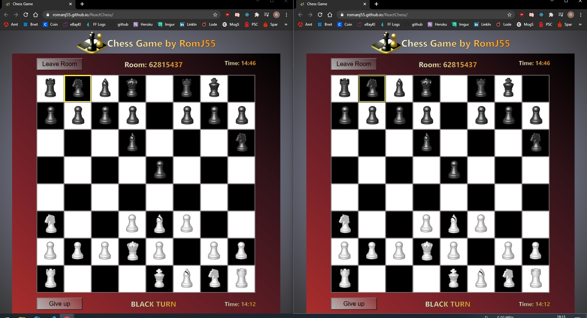

# Chess Game with React as the frontend and Python in the backend

Using my own Python-Chess game project as the backend

- https://github.com/RomanJ55/Chess-Game

Added Flask and gunicorn for the server/api
  - backend: https://github.com/RomanJ55/backend

---

Fully functional chess game following the standard chess rules: https://en.wikipedia.org/wiki/Rules_of_chess

- Time is set to 15 Minutes by default

---

Not working:

- en passant moves https://support.chess.com/article/683-what-is-en-passant
  (I didn't know they existed...)

---

# Check it out here(react may freak out if too many connections):

https://romanj55.github.io/ReactChess/

---

